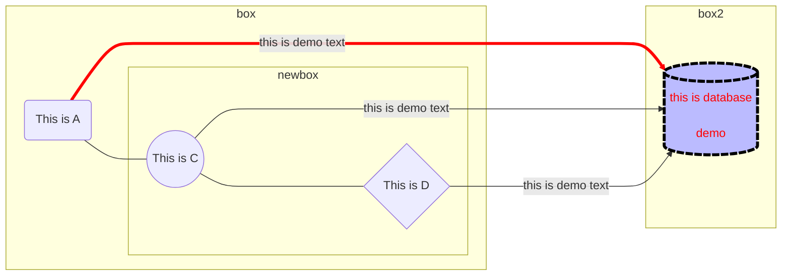
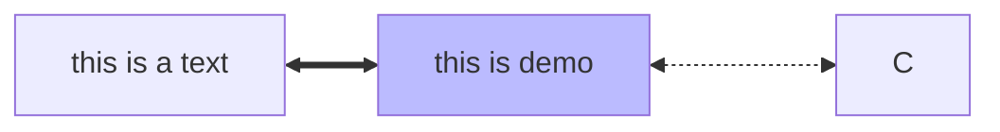
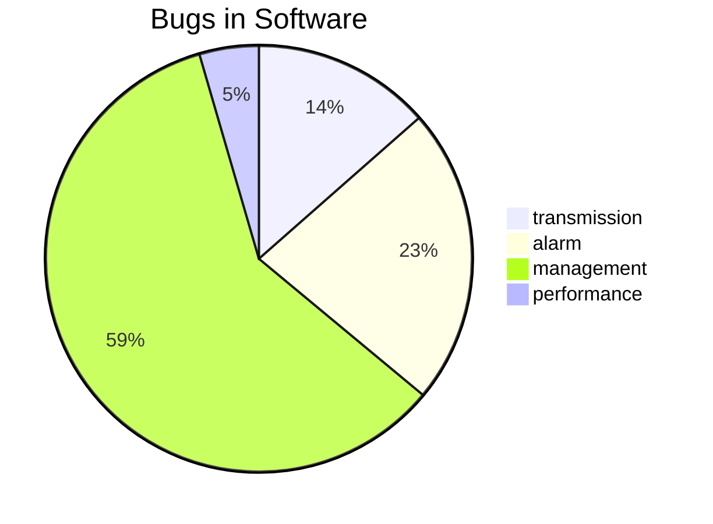
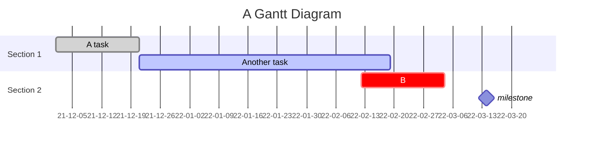
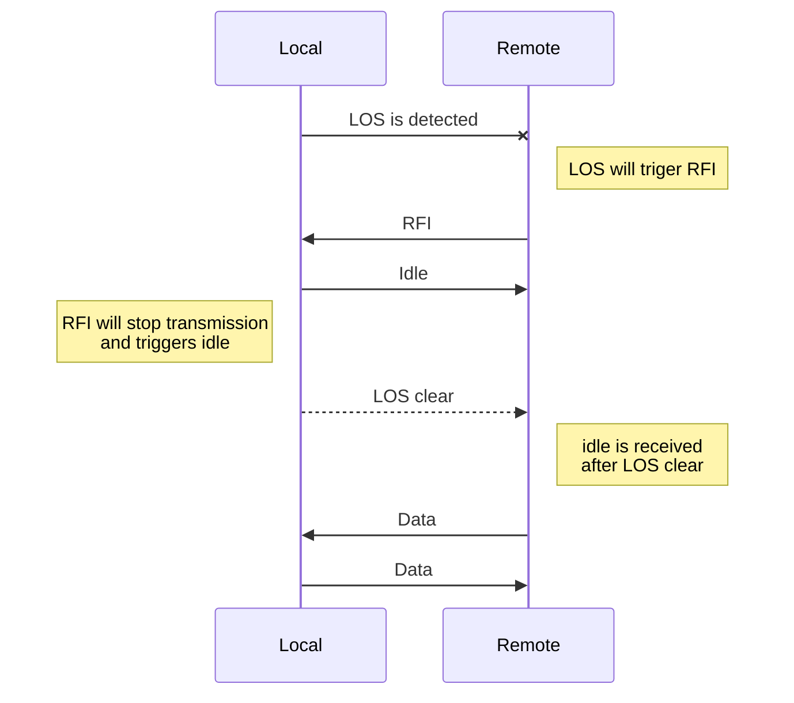
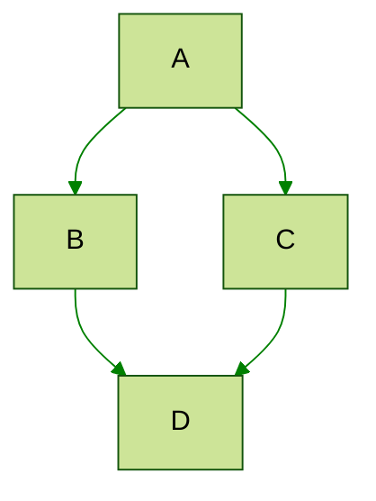

---
chrome:
    printBackground: true
    format: "A4"
html:
    toc: true

toc:
    depth_from: 2
    depth_to: 6
    ordered: false
---

<!--- 
chrome.format: use "A3" for wider print, or use  "tabloid"
--->


# MPE Demo Note {ignore}

[TOC]

## Reference Link

- [markdown guide](https://www.markdownguide.org/getting-started/)
- [markdown preview enhanced](https://shd101wyy.github.io/markdown-preview-enhanced/#/)
- [markdown cheat sheet](https://www.markdownguide.org/cheat-sheet/)
- [markdown cheat sheet md file](https://www.markdownguide.org/assets/markdown-cheat-sheet.md)


## Front settings 

- chrome print settings

```
---
chrome:
    printBackground: true
    format: "A4" "tabloid" "A3"
---

```
- html output settings

```
---
html:
    embed_local_images: false
    embed_svg: true
    offline: false
    toc: true
    print_background: false
---

---
toc:
  depth_from: 2
  depth_to: 6
  ordered: false
---


```

- PanDoc Print Settings

```
---
title: "this_is_title"
author: author_name
date: Jan 14, 2022
output:	
    word_document:
        highlight: "tango"
---

```

## Definition  

GitHub
    : GitHub is a website with Git tool

## Abbreviation 
*[YYDS]: Yong Yuan De Shen - God forever
YYDS

## footnote

Demo[^1] a footnote

[^1]: this a footnote

## comment

1. html comment
    <!---
    this is my comment 
    -->
    ```
    <!---
    your comment goes here
    and here
    -->
    ```
1. markdown
    ```
    (empty line)
    [comment]: # (This actually is the most platform independent comment)
    ```
    [comment]: # (this is a comment)

1. markdown

    [this is comment]: #

    ```
    [this is a comment]: #
    ```


1. footnote no referenced
    ```
    [^Comment]:  Text that will not appear in html source
    ```
    [^Comment]:  Text that will not appear in html source
## task

- [ ] task 1 
- [x] task 1 

## emoji and html symbol
- Reference link: [html symbol](https://www.toptal.com/designers/htmlarrows/)

- `&micro;` time is 10&micro;s 
- `&deg;` temperature is 20&deg;
- `&plusmn;`&plusmn;25
- `&le; &ge; &ne;` &le; &ge; &ne;
- `&trade; &reg;`  Google&trade; &reg;Google
- `&copy;` &copy;2002
- `&raquo;&laquo;` &raquo; &laquo;
- `&nbsp;&nbsp;&nbsp;&nbsp;` &nbsp;&nbsp;&nbsp;&nbsp;
- `&#8800;`  &#8800;
- positive signs: 
    - :+1: :100: :joy: :accept: :heart: :beer: :beers: :white_check_mark:
    - `:+1: :100: :joy: :accept: :heart: :beer: :beers: :white_check_mark:`
    - :ok: `:ok:`
    
- neutral
    - :eyes: :alien: :confused:
    - `:eyes: :alien: :confused:`
- negative
    - :-1: :angry: :sweat: :sob: `:-1: :angry: :sweat: :sob: `
    - :broken_heart: `:broken_heart:`
    - :bug: `:bug:`
- Informational
    - :memo:`:memo`
    - :question: `:question:`
    - :no_entry: :no_entry_sign:  `:no_entry: :no_entry_sign:`
    - :bookmark_tabs: :information_source: :warning: `:bookmark_tabs: :information_source: :warning:`
    - :arrow_right: :arrow_left: :arrow_up: :arrow_down: `:arrow_right: :arrow_left: :arrow_up: :arrow_down`
    - :ballot_box_with_check:`:ballot_box_with_check:`
    - &#9744;&#9745;&#9746;`&#9744; &#9745;&#9746;`
    - &rarr; &larr; &uarr; &darr; `&rarr; &larr; &uarr; &darr;`
    - :bangbang: `:bangbang: `
    - :boom: `:boom:`
    - :chart_with_downwards_trend: :chart_with_upwards_trend: `:chart_with_downwards_trend: :chart_with_upwards_trend:`
    - :page_with_curl: `:page_with_curl:`
    - :link: `:link:`
    - ❌ `:x:`
    - &#8226; `&#8226;`
    - &#9702; `&#9702;` &#9726; `&#9726;`
    - &#9724; 	&#10148; &#10147; 	&#8680;&#11044;&#9658;

- [git moji](https://gitmoji.dev/)
    - :memo: for doc update
    - :bug: for bug fix
    - :tada: for new project
    - :sparkles: for new features
    - :poop: bad code for future improvement
    - :pencil2: typos corrected
    - :writing_hand: :star: minor update 
    
## List Level Demo {#section11}

- This is a list level 1
    - this is a list level 2
    - this is a list level 2
        - this a list level 3
- This is a list level 1

1. This is a list level 1
    - this is a list level 2
        - this is a list level 3
1. this is a list level 1
    - this is a list level 2

## Horizontal Line Demo

---

this is a demo

---

```
(empty line)
---
(empty line)
text
(empty line)
---
(empty line)
```

***
this is a demo
***

```

***

text

***

```

## link demo

- [demo the link within the doc](#horizontal-line-demo)

```
[demo the link within the doc](#horizontal-line-demo)
```
- [demo the link within the doc use the id](#section11)

```
[demo the link within the doc use the id](#id)
id is using the #xxx{id}

### My Great Heading {#custom-id}
```

- [demo the link to another file](./README.md)

```
[demo the link to another file](./README.md)
```
- [demo the link to another file](./README.md#mpedemonote)

```
- [demo the link to section in another file](./README.md#mpedemonote)

```
- [demo the external link](https://github.com/jeffatoptics/MPEDemoNote)

- <https://github.com/jeffatoptics/MPEDemoNote>

## html syntax

- <mark> this is a mark</mark>
- ==this is a mark==

- <b>this is bold</b>
- **bold**

- <u> this is underline</u>
- <ins>will be underlined</ins>

- <i>this is italic</i>
- _this is italic_

- <s>test</s>
- ~~test~~

- <font color=red>test font as red</font>
- <p style="color:blue">Make this text blue.</p>

- H<sub>2</sub>O
- H~2~O

- Y=X^2^

- Y=X<sup>2</sup>

- [x] task list

- [ ] task list 

>:bulb: Tips for center the text
```
<center>This text is centered.</center>
<p style="text-align:center">Center this text</p>
```

<center>This text is centered.</center>
<p style="text-align:center">Center this text</p>

### two columns with the demo

- this is demo to 2 columns

<div style="columns: 2;">

The project presents the markdown templates for MPE (Markdown Preview Enhanced) extension to generate PDF pages with header, footer and page break via with Chrome (puppeteer). The settings are demonstrated in the front matter of markdown file.

Editor and extension are listed as following:

</div>
### page break

```

<!---->


```

### ruby note

<ruby>饕餮 <rt>tāo tiè</rt></ruby> 

<ruby>1830 <rt>Beer</rt></ruby> 

[  ā, á, ǎ, à, ō, ó, ǒ, ò, ê, ê̄, ế, ê̌, ề, ē, é, ě, è, ī, í, ǐ, ì, ū, ú, ǔ, ù, ü, ǖ, ǘ, ǚ, ǜ, m̄, ḿ, m̀, ń, ň, ǹ, ẑ, ĉ, ŝ, ŋ


## definition

term
: this is for a demo of definition

term2
: this is for a demo of definition
: another definition for term2


## Code Demo 

- language: python, cmd, bash, diff, c, json

``` {.line-numbers, highlight=[2,3,6-7]}
import numpy, math
a="this is a text"
print (a)
b=math.pi
c=a+a
for i in a
    print(i)

```

```diff {.line-numbers}
# this is a demo text
config interface 1/1/line state donw
+ print ("this is done")
- print ("this is not done") 

```
```python {cmd=true}
a="this is a demo"
print ("begin:")
for i in a:
    print(i)
print("end")
```

- use import

@import "./testpy.py" {.line-numbers, highlight=[1,7-8]}

@import "./testpy.py" {code_block=true class="line-numbers" line_begin=5 line_end=8}

- import with code chunk

@import "./testpy.py" {cmd="python"}

>:memo:Option name: enableScriptExecution


```bash {cmd=true hide=true}
pwd 
ls -l
```

```python {cmd=true matplotlib=true modify_source=false args=["-X","utf8"]}

import matplotlib.pyplot as plt
import numpy as np
x=np.arange(0,40,0.1)
y=np.sin(x)
plt.plot(x,y)
plt.show() # show figure

```
>:bulb: **Tips**  
    use `modify_source=true` to check what is the error output if print is abnormal.
    "python -X utf8" force the MPE program to open file with utf8 in windows system


## Admonitions

```
> :warning: **Warning:** Do not push the big red button.

> :memo: **Note:** Sunrises are beautiful.

> :bulb: **Tip:** Remember to appreciate the little things in life.
```
> :warning: **Warning:** Do not push the big red button.

> :memo: **Note:** Sunrises are beautiful.

> :bulb: **Tip:** Remember to appreciate the little things in life.

> :question: This is a question

> :heavy_check_mark: success

> :white_check_mark: success

> :x: this is a failure

!!!warning this is a warning
    text to put

!!!note this is a note
    text to put

!!!info this is an info
    text to put    

!!!abstract this is an abstract
    text to put    

!!!tip this is an info
    text to put  

!!! Success

!!! Question

!!! Failure

!!! Danger

!!! Bug

!!! Example
    
!!! Quote

```

 Note
 Abstract
 Inf
 Tip
 Success
 Question
 Warning
 Failure
 Danger
 Bug
 Example
 Quote

```  


## Math 

- [Math symbols](https://khan.github.io/KaTeX/function-support.html)

- This is an inline equation: $ y=\sqrt{x^2-1} $ and $ y=\sqrt[4]{x^2-1} $
- This is an equation block
    $$
    y=\frac{1}{2} \times \sqrt{x^2-1} \\
    y=\cfrac{1}{2+\cfrac{1}{2}}     \\
    y=\int \! (x^2-1) dx             \\
    y=\int (x^2-1) dx                \\
    y=\int_{a}^{b=10} (x^2-1) dx            \\
    y=\sum_{x=1}^ {100} (x^2-1)- 1          \\
    BER= erfc(\frac{Q}{\sqrt{2}})
    $$


$$
\fbox {this is a demo equation:}   \\
BER= erfc(\frac{Q}{\sqrt{2}})
$$


## mermaid















<div class="mermaid">
%%{init: {'theme':'forest', 'themeVariables': { 'lineColor': 'green' }}}%%
graph TD;
    A-->B;
    A-->C;
    B-->D;
    C-->D;
</div>

```
<div class="mermaid">
%%{init: {'theme':'forest', 'themeVariables': { 'lineColor': 'green' }}}%%
graph TD;
    A-->B;
    A-->C;
    B-->D;
    C-->D;
<div>
```

```


## sequence
sequence is similar to **mermaid** `sequenceDiagram`, but it supports hands style.

```sequence {theme="hand"}
    participant Local
    participant Remote
    Local->Remote: LOS is detected
    Note right of Remote: LOS will triger RFI
    Remote->>Local: RFI
    Local->>Remote: Idle 
    Note left of Local: RFI will stop transmission \n and triggers idle
    
    Local-->>Remote: LOS clear
    Note right of Remote: idle is received \n after LOS clear
    Remote->>Local: Data
    Local->>Remote: Data
```

## images

-  import
    @import "./images/sunflower.jpg"

    @import "./images/sunflower.jpg" {width="100px" title="sunflower" alt="a sunflower under the blue sky"}

- markdown
    

- html
    <p align=center>
    </img></p>

- more complex html

```
<figure>
    
    <figcaption> This Is Sunflower under blue sky</figcaption>
</figure>
```

<figure>
    
    <figcaption> Sunflower under Blue Sky</figcaption>
</figure>

## tables

| item1 | attribute 1 | attribute 2 | attribute 3 |
|:------|:------------|:------------|:------------|
| aa    | bb          | cc          | dd          |


| item1 | attribute 1 | attribute 2 | attribute 3 |
|:------|:------------|:------------|:------------|
| aa    | bb          | cc          | dd          |
| ^     | ee          | ff          | gg          |
|   a   | hh          |             | ii          |